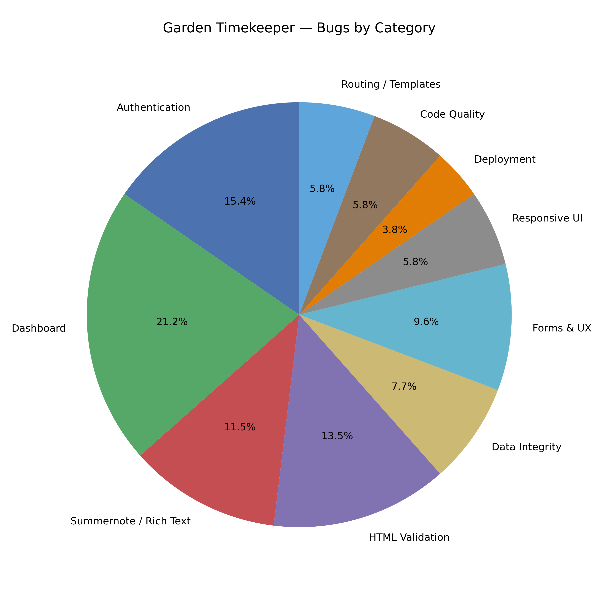

# 🐛 Garden Timekeeper — Summary of Bugs

This document provides a summary of the bugs fixed during the development of **Garden Timekeeper**.  
Each entry includes:

- Issue number  
- Title  
- Category  
- Priority  
- Status  
- Fix summary  
- Direct GitHub link  

<br>

# Table of Bugs
| # | Title | Category | Priority | Status | Fix Summary |
|---|-------|----------|----------|--------|-------------|
| [234](https://github.com/mrosevere/garden_timekeeper/issues/234) | Reset password emails not arriving | Authentication | Must‑have | Done | Corrected email backend config and domain settings. |
| [209](https://github.com/mrosevere/garden_timekeeper/issues/209) | Login error message not visible | Accessibility / Auth | Must‑have | Done | Added contrast and background styling. |
| [129](https://github.com/mrosevere/garden_timekeeper/issues/129) | “Remember me” not working | Authentication | Should‑have | Done | Fixed session expiry logic. |
| [117](https://github.com/mrosevere/garden_timekeeper/issues/117) | Username not displaying on Dashboard | UX / Auth | Should‑have | Done | Passed username context to template. |
| [110](https://github.com/mrosevere/garden_timekeeper/issues/110) | System crashes if registering with no data | Forms / Auth | Must‑have | Done | Added required field validation. |
| [100](https://github.com/mrosevere/garden_timekeeper/issues/100) | Username field case sensitive | Authentication | Must‑have | Done | Normalised username input. |
| [113](https://github.com/mrosevere/garden_timekeeper/issues/113) | Missing icon on login/registration mobile view | UI / Auth | Should‑have | Done | Fixed missing asset reference. |
| [99](https://github.com/mrosevere/garden_timekeeper/issues/99) | Login page does not display | Templates / Auth | Must‑have | Done | Corrected template path and view routing. |
| [266](https://github.com/mrosevere/garden_timekeeper/issues/266) | Lighthouse Testing: Home Page | Performance | Should‑have | Done | Improved contrast, added alt text, optimised DOM structure. |
| [241](https://github.com/mrosevere/garden_timekeeper/issues/241) | HTML Validation: Dashboard Page | HTML Validation | Should‑have | Done | Corrected heading hierarchy and void element syntax. |
| [247](https://github.com/mrosevere/garden_timekeeper/issues/247) | HTML Validation: Dashboard Page: Error | HTML Validation | Should‑have | Done | Fixed incorrect `<h6>` placement and heading level jumps. |
| [230](https://github.com/mrosevere/garden_timekeeper/issues/230) | HTML Validation: Dashboard Page | HTML Validation | Should‑have | Done | Fixed void element syntax and heading order. |
| [210](https://github.com/mrosevere/garden_timekeeper/issues/210) | Dashboard action button layout breaks | Responsive UI | Should‑have | Done | Improved flexbox layout and breakpoints. |
| [201](https://github.com/mrosevere/garden_timekeeper/issues/201) | Dashboard “Due” tasks unreadable | UI / Accessibility | Won’t‑fix | Closed | Could not reproduce; likely caching/refresh issue. |
| [186](https://github.com/mrosevere/garden_timekeeper/issues/186) | Default Sort not displaying | UX | Should‑have | Done | Added default sort indicator. |
| [181](https://github.com/mrosevere/garden_timekeeper/issues/181) | Dashboard Table View not paged | UX / Pagination | Must‑have | Done | Added pagination to dashboard table. |
| [136](https://github.com/mrosevere/garden_timekeeper/issues/136) | Dashboard back month button not working | JS / Dashboard | Must‑have | Done | Fixed JS event binding and date logic. |
| [122](https://github.com/mrosevere/garden_timekeeper/issues/122) | Console errors on Login/Registration | JS | Must‑have | Done | Removed invalid selectors and fixed event listeners. |
| [228](https://github.com/mrosevere/garden_timekeeper/issues/228) | Two Summernote fields on Add Task Page | Summernote | Must‑have | Done | Removed duplicate field initialisation. |
| [182](https://github.com/mrosevere/garden_timekeeper/issues/182) | Summernote menu buttons not working | Summernote | Must‑have | Done | Fixed JS initialisation and toolbar config. |
| [147](https://github.com/mrosevere/garden_timekeeper/issues/147) | Add/Edit Plant Notes: Images not added | Summernote | Must‑have | Done | Fixed media upload config and form handling. |
| [132](https://github.com/mrosevere/garden_timekeeper/issues/132) | Plant detail page shows raw HTML | Summernote | Must‑have | Done | Applied safe filter and sanitised output. |
| [123](https://github.com/mrosevere/garden_timekeeper/issues/123) | WYSIWYG import image not working | Summernote | Must‑have | Done | Fixed media upload path and plugin config. |
| [108](https://github.com/mrosevere/garden_timekeeper/issues/108) | Django 6.x incompatibility with Summernote | Framework | Must‑have | Done | Updated Summernote config and dependencies. |
| [246](https://github.com/mrosevere/garden_timekeeper/issues/246) | Task Details Page | HTML Validation | Should‑have | Done | Corrected heading order, removed stray tags, fixed ARIA attributes. |
| [240](https://github.com/mrosevere/garden_timekeeper/issues/240) | Unauthenticated Home Page | HTML Validation | Should‑have | Done | Fixed invalid nesting and stray closing tags. |
| [243](https://github.com/mrosevere/garden_timekeeper/issues/243) | Plant Edit Template | HTML Validation | Should‑have | Done | Removed invalid comment markers and corrected duplicate IDs. |
| [245](https://github.com/mrosevere/garden_timekeeper/issues/245) | Create Task Page | HTML Validation | Should‑have | Done | Fixed ARIA references, removed invalid comments, corrected IDs. |
| [244](https://github.com/mrosevere/garden_timekeeper/issues/244) | plant_create page | HTML Validation | Should‑have | Done | Fixed duplicate IDs, invalid ARIA attributes, modal markup issues. |
| [232](https://github.com/mrosevere/garden_timekeeper/issues/232) | Plant List Page | HTML Validation | Should‑have | Done | Corrected heading order and void element syntax. |
| [231](https://github.com/mrosevere/garden_timekeeper/issues/231) | Bed List Page | HTML Validation | Should‑have | Done | Corrected heading levels and stray tags. |
| [217](https://github.com/mrosevere/garden_timekeeper/issues/217) | Duplicate bed name = 500 | Data Integrity | Must‑have | Done | Added unique constraint handling and user‑friendly error. |
| [191](https://github.com/mrosevere/garden_timekeeper/issues/191) | Server 500 when selecting some Tasks | Data Integrity | Must‑have | Done | Fixed missing task relationships and queryset filtering. |
| [143](https://github.com/mrosevere/garden_timekeeper/issues/143) | Deleting a bed deletes all plants | Data Integrity | Must‑have | Done | Changed cascade rules and added protection. |
| [118](https://github.com/mrosevere/garden_timekeeper/issues/118) | Tasks not restricted by user | Security / Data | Must‑have | Done | Added user scoping to all task queries. |
| [224](https://github.com/mrosevere/garden_timekeeper/issues/224) | No error message when Plant Name missing | Forms | Must‑have | Done | Added form validation and error messaging. |
| [199](https://github.com/mrosevere/garden_timekeeper/issues/199) | Modal appears when logging in with no data | UX | Should‑have | Done | Removed stray modal trigger logic. |
| [111](https://github.com/mrosevere/garden_timekeeper/issues/111) | Task Detail missing due date | Templates | Must‑have | Done | Added due date field. |
| [109](https://github.com/mrosevere/garden_timekeeper/issues/109) | Create Task Issues | Forms / UX | Must‑have | Done | Fixed field ordering, validation, and redirects. |
| [106](https://github.com/mrosevere/garden_timekeeper/issues/106) | Add Plant → Add New Bed clears fields | UX | Should‑have | Done | Preserved form state across modal actions. |
| [187](https://github.com/mrosevere/garden_timekeeper/issues/187) | Plant image overlaps on small screens | Responsive UI | Should‑have | Done | Adjusted CSS and image container rules. |
| [210](https://github.com/mrosevere/garden_timekeeper/issues/210) | Dashboard action buttons break layout | Responsive UI | Should‑have | Done | Improved flexbox layout. |
| [161](https://github.com/mrosevere/garden_timekeeper/issues/161) | Header wraps at 320px | Responsive UI | Should‑have | Done | Adjusted breakpoints and spacing. |
| [178](https://github.com/mrosevere/garden_timekeeper/issues/178) | Images not showing on Heroku | Deployment | Must‑have | Done | Fixed static/media settings and Cloudinary config. |
| [121](https://github.com/mrosevere/garden_timekeeper/issues/121) | All CSS styling broken | Deployment | Must‑have | Done | Corrected static paths and re‑collected files. |
| [263](https://github.com/mrosevere/garden_timekeeper/issues/263) | JavaScript Validation | Code Quality | Should‑have | Done | Cleaned unused variables and warnings. |
| [259](https://github.com/mrosevere/garden_timekeeper/issues/259) | PEP8: core/views.py | Code Quality | Could‑have | Done | Reformatted file. |
| [260](https://github.com/mrosevere/garden_timekeeper/issues/260) | PEP8: test_task_views.py | Code Quality | Could‑have | Done | Cleaned imports and spacing. |
| [208](https://github.com/mrosevere/garden_timekeeper/issues/208) | Task link goes to Edit instead of Details | Routing | Must‑have | Done | Corrected URL mapping. |
| [162](https://github.com/mrosevere/garden_timekeeper/issues/162) | Server 500 on Add Bed Page | Routing | Must‑have | Done | Fixed incorrect view path. |
| [103](https://github.com/mrosevere/garden_timekeeper/issues/103) | Bed List not displaying | Templates | Must‑have | Done | Fixed queryset and template loop. |


<br>

# Bugs grouped by Category


<br>

# 🕒 3. Visual Timeline of Development

```
Phase 1 — Foundations & Authentication (Issues #99–#123)
███████████████

Phase 2 — Data Integrity & Core Models (Issues #132–#147)
████████████████████

Phase 3 — Dashboard & UX Improvements (Issues #161–#210)
██████████████████████████████████

Phase 4 — Summernote & Rich Text Stability (Issues #108, #123, #132, #147, #182, #228)
██████████████

Phase 5 — HTML Validation Sweep (Issues #230–#254)
████████████████████████████████████████████████████████

Phase 6 — Final Polish & Code Quality (Issues #259–#269)
██████████████████
```

<br>
